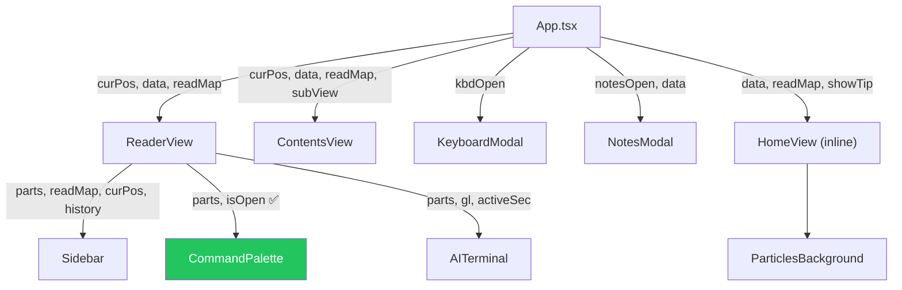

# PMN Framework — React Migration State Document
# Untuk Semua AI Agent (Antigravity IDE / Opus / Gemini 3.5 / Grok / dll)

> **PERINGATAN AUDIT 2026-06-07:** Status di dokumen ini sudah tertinggal. Runtime React saat ini mengalami blank screen akibat pelanggaran urutan Hooks walaupun build dan TypeScript lolos. Sebelum mengedit UI, baca `PRD.md` lalu `Dokumentasi_AI/PMN_UI_MIGRATION_AUDIT_2026-06-07.md`. Keduanya menjadi spesifikasi dan audit terbaru, termasuk aturan diagnosis alignment/centering berbasis root cause.

**Last Updated**: 2026-06-05T17:48+07:00  
**Updated By**: Antigravity IDE (Claude Opus 4.6 Thinking)  
**Project**: Progressive Materialist Naturalism (PMN) — Interactive Manuscript Reader

> **BACA INI SEBELUM EDIT APAPUN.** 
> Dokumen ini adalah sumber kebenaran bagi semua AI agent yang bekerja di repo ini.
> Setiap kali selesai sesi, UPDATE file ini dengan perubahan yang dibuat.

---

## 1. ARSITEKTUR PROYEK

### 1.1 Lokasi Utama
```
D:\Master-Universe\pmn-workspace\
├── public\                          ← ROOT PROYEK REACT (npm/vite/build di sini)
│   ├── package.json                 ← name: "pmn-framework"
│   ├── vite.config.js               ← base: '/pmn-framework/', publicDir: 'public_static'
│   ├── tsconfig.json                ← strict:false, jsx:react-jsx, target:ES2020
│   ├── index.html                   ← ✅ React entry point (661 bytes, <div id="root">)
│   │                                   Sudah di-swap dari monolith. Build output ~0.8KB.
│   ├── style.css                    ← Master CSS legacy (~101KB). Semua visual ada di sini.
│   ├── app.js / app.ts              ← Legacy vanilla JS/TS (TIDAK dipakai di React)
│   ├── src\                         ← SOURCE CODE REACT
│   │   ├── main.tsx                 ← Entry: import App, index.css, style.css
│   │   ├── index.css                ← Tailwind v4 + @theme tokens PMN
│   │   ├── App.tsx                  ← Root component: routing, state, HomeView, ThesisItem, AdminLogin
│   │   └── components\
│   │       ├── ReaderView.tsx       ← Halaman baca: sidebar + prose + xref + notes + endcap
│   │       ├── ContentsView.tsx     ← Daftar isi (TOC) + Glossary (tab dikontrol parent)
│   │       ├── Sidebar.tsx          ← Sidebar reader (parts list, history, font controls)
│   │       ├── CommandPalette.tsx   ← Modal pencarian section (/ hotkey)
│   │       ├── AITerminal.tsx       ← AI handoff terminal (copy prompt ke ChatGPT dll)
│   │       ├── KeyboardModal.tsx    ← Modal shortcut keyboard (K hotkey)
│   │       ├── NotesModal.tsx       ← Modal catatan tersimpan (N hotkey)
│   │       ├── ParticlesBackground.tsx ← Canvas particle effect di hero
│   │       └── VersionManager.tsx   ← Admin panel (login: admin/pmn117)
│   ├── src\lib\
│   │   ├── supabase.js              ← Supabase client (future use)
│   │   └── pmn-backend.js           ← Backend helpers (future use)
│   ├── public_static\               ← Vite publicDir → aset statis
│   │   └── data\                    ← JSON data manuskrip
│   │       ├── parts.json           ← Konten manuskrip (~2.3MB)
│   │       ├── gl.json              ← Glossary definitions
│   │       ├── glg.json             ← Glossary groups
│   │       ├── look.json            ← Section lookup index (id → pi/si/title)
│   │       ├── rel.json             ← Related sections map
│   │       ├── ci.json              ← Cross-index
│   │       └── quotes.json          ← Rotating quotes
│   ├── dist\                        ← Build output
│   ├── Dokumentasi_AI\              ← FOLDER INI — docs untuk AI agents
│   └── private/                     → Symlink/referensi ke ../private
├── private\
│   ├── Referensi Versi Lama\        ← 32 screenshot PNG + 2 HTML referensi visual
│   │   ├── Versi Lama (1-24).png    ← Screenshot tampilan lama yang harus dimatch
│   │   ├── Axiom Structure (1-2).png
│   │   ├── Reading Paths.png, Reader Desk.png, etc.
│   │   ├── index.ui.html            ← Referensi HTML struktur lama (tanpa inline CSS/JS)
│   │   └── index.maintenance.html   ← Template maintenance page
│   ├── backups\                     ← Backup timestamped sebelum edit besar
│   └── Screenshot\                  ← Screenshot testing
└── backup\
    ├── index.html.maintenance_backup ← React entry HTML (661 bytes, <div id="root">)
    └── index.maintenance.html       ← Copy monolith saat swap ke React
```

### 1.2 Tech Stack
| Layer        | Technology                                   |
|-------------|----------------------------------------------|
| Framework   | React 18.2 + TypeScript 6                    |
| Build       | Vite 5.1.4 + @vitejs/plugin-react 4.2.1      |
| CSS         | Tailwind CSS v4.3 (@tailwindcss/vite) + Legacy style.css |
| Backend     | Supabase (stub, belum aktif)                  |
| Data        | Static JSON di public_static/data/            |
| Deploy      | GitHub Pages (base: /pmn-framework/)          |
| Fonts       | Google Fonts: Libre Baskerville, Lora, Source Code Pro |

### 1.3 SWAP MECHANISM (index.html)
**PENTING — Saat ini index.html adalah MONOLITH HTML LAMA (maintenance mode).**

Untuk menjalankan React app:
- **Otomatis**: Jalankan `LIHAT_HASIL_LOKAL.bat` — swap index.html → React entry, jalankan vite dev, restore on exit
- **Manual**: Copy `backup/index.html.maintenance_backup` → `index.html`, lalu `npm run dev`
- **React entry HTML** (661 bytes):
  ```html
  <!DOCTYPE html>
  <html lang="en" data-theme="dark">
    <head>
      <meta charset="UTF-8" />
      <meta name="viewport" content="width=device-width, initial-scale=1.0" />
      <title>Progressive Materialist Naturalism</title>
      <link rel="preconnect" href="https://fonts.googleapis.com">
      <link href="https://fonts.googleapis.com/css2?family=..." rel="stylesheet">
    </head>
    <body>
      <div id="root"></div>
      <script type="module" src="/src/main.tsx"></script>
    </body>
  </html>
  ```

**⚠️ Jika index.html pernah di-restore ke monolith, swap ulang sebelum dev/build.**
**✅ Saat ini index.html sudah React entry. Build output: dist/index.html = 0.79KB.**

---

## 2. CSS ARCHITECTURE

### 2.1 Dua Layer CSS (Jangan Ubah Urutan!)
```
main.tsx:
  import './index.css'    ← (1) Tailwind v4 utilities + @theme tokens
  import '../style.css'   ← (2) Legacy master CSS (semua visual PMN)
```

**ATURAN KRITIS:**
- `style.css` di-import **LANGSUNG** di `main.tsx`, BUKAN di dalam `index.css` `@layer base`
- Jika dimasukkan ke `@layer`, Tailwind cascade akan menimpa semua legacy rules → UI hancur
- `index.css` hanya berisi `@import "tailwindcss"` + `@theme { ... }` (token warna/font)

### 2.2 @theme Tokens (Tailwind v4)
`@theme` harus pakai **nilai static hex**, bukan `var()` references!
```css
/* ✅ BENAR */
--color-pmn-bg: #0d0d0d;
--color-pmn-acc: #c0271a;

/* ❌ SALAH — Tailwind v4 tidak resolve var() di @theme */
--color-pmn-bg: var(--bg);
```

### 2.3 CSS Variable Mapping
| CSS var (style.css) | Tailwind token | Usage |
|----|----|----|
| `--bg` | `bg-pmn-bg` | Background utama |
| `--bg2` | `bg-pmn-bg2` | Background secondary |
| `--ink` | `text-pmn-ink` | Text utama |
| `--acc` | `text-pmn-acc` | Accent red (#c0271a) |
| `--rule` | `border-pmn-rule` | Border lines |
| `--mute` | `text-pmn-mute` | Muted text |
| `--f-head` | `font-pmn-head` | Libre Baskerville |
| `--f-body` | `font-pmn-body` | Lora |
| `--f-mono` | `font-pmn-mono` | Source Code Pro |

---

## 3. COMPONENT MAP & PROPS

### 3.1 App.tsx (Root)
**State utama:**
- `page`: 'home' | 'contents' | 'reader' | 'login' | 'admin'
- `theme`: 'dark' | 'light' (LS: 'pmn-theme')
- `data`: Loaded JSON ({parts, gl, glg, rel, look, quotes, ci})
- `curPos`: [partIdx, secIdx] (LS: 'pmn-pos')
- `readMap`: Record<string, boolean> (LS: 'pmn-read')
- `history`: [number, number][] last 5 positions (LS: 'pmn-history')
- `contentWidth`: 'narrow' | 'medium' | 'wide' (LS: 'pmn-content-width')
- `paletteTrigger`: number (increment to force open CommandPalette)
- `kbdOpen`, `notesOpen`: boolean (modals)
- `showTip`: boolean (hero orientation tip, LS: 'pmn-tip-dismissed')

**Global hotkeys (outside inputs):**
- `K` → toggle KeyboardModal
- `N` → toggle NotesModal
- `/` → force reader + open CommandPalette
- `F` → toggle body.focus-mode

**Inline sub-components:**
- `HomeView` — hero, marquee, reading paths, anatomy terminal, axiom accordion, reader desk, footer
- `ThesisItem` — accordion item untuk axiom
- `AdminLogin` — login form (admin/pmn117)

### 3.2 ReaderView.tsx
**Props:** data, curPos, readMap, onMarkRead, onSavePosition, onBackHome, theme, onToggleTheme, forceOpenPalette, contentWidth, onChangeWidth, history

**Features:**
- Sidebar (left) + Main prose (right)
- Dynamic xref linking (DOM-walk `useEffect` on prose content)
- Hover preview card on xref
- Selection → glossary tooltip
- Section notes (localStorage per section id)
- Focus mode (body.focus-mode)
- Font scale controls (--reader-scale, LS: 'pmn-reader-scale')
- CommandPalette integration

### 3.3 ContentsView.tsx
**Props:** data, readMap, curPos, subView, onSelectSection, onBackHome, onSetSubView, contentWidth, onChangeWidth

**Features:**
- TOC grid (manuscript map) — vertical parts + sub-sections
- Glossary view (grouped by glg.json)
- Quote strip with rotation
- Content width selector (N/M/W buttons)
- Controlled by parent via subView prop (no internal tabs)

### 3.4 Sidebar.tsx
**Props:** parts, readMap, curPos, onSelectSection, onClose, history

**Features:**
- Part labels (red accent on active)
- Section list with read status (✓)
- Recent history (dynamic from history prop)
- Sidebar font size controls

### 3.5 CommandPalette.tsx
**Props:** parts, onSelectSection, isOpen, onClose

**✅ FIXED (2026-06-05 17:48):** Sekarang menerima `parts={data.parts} isOpen={commandPaletteOpen}` — sudah benar.

---

## 4. KNOWN BUGS & ISSUES

### 4.1 Kritikal
| # | Issue | Status | Detail |
|---|-------|--------|--------|
| 1 | ~~CommandPalette props mismatch~~ | ✅ FIXED | Sekarang menerima `parts` & `isOpen` yang benar. |
| 2 | ~~index.html = monolith~~ | ✅ FIXED | Sudah React entry (0.79KB build output). |
| 3 | ~~Build bundles monolith~~ | ✅ FIXED | Build output sekarang correct: 0.79KB index + 122KB CSS + 221KB JS. |

### 4.2 Non-Kritikal
| # | Issue | Status | Detail |
|---|-------|--------|--------|
| 4 | ~~`preview` state type mismatch~~ | ✅ FIXED | Type sekarang `kicker`/`excerpt` sesuai usage. |
| 5 | Long section IDs (how-to-read-this-document, dll) | ⚠️ OPEN | `shortenId()` ada tapi tidak konsisten dipanggil |
| 6 | Hero orientation tip tidak ada di `LIHAT` bat swap flow | ℹ️ INFO | Tip persists via LS, hanya relevan di React build |
| 7 | ~~`onMarkRead` never called~~ | ✅ FIXED | Auto-mark read setelah 3 detik membaca section. |

---

## 5. BAGAIMANA MENJALANKAN

### 5.1 Development (React)
```powershell
cd D:\Master-Universe\pmn-workspace\public

# Pastikan index.html = React entry (661 bytes, <div id="root">)
# Jika masih monolith, swap dulu:
copy "D:\Master-Universe\pmn-workspace\backup\index.html.maintenance_backup" index.html

# Jalankan
npm run dev
# → http://localhost:5173/pmn-framework/  (atau port lain jika 5173 occupied)
```

### 5.2 Production Build
```powershell
# Pastikan index.html = React entry DULU
npm run build
# Output di dist/ — harus ~1.5KB index.html, bukan 2.7MB
```

### 5.3 Via BAT file
- `LIHAT_HASIL_LOKAL.bat` — Auto swap + dev + restore on exit
- `PRATINJAU_UI_LOKAL.bat` — Alternatif preview

---

## 6. REFERENSI VISUAL

Folder: `private/Referensi Versi Lama/`

| File | Menunjukkan |
|------|-------------|
| Versi Lama (1).png | Full reader view |
| Versi Lama (2).png | Cover hero (stats, tip card, CTAs, scroll) |
| Versi Lama (3).png | Orientation tip close-up |
| Versi Lama (4-5).png | Header bar layout |
| Versi Lama (6).png | Hero zoomed |
| Versi Lama (8).png | Anatomy terminal (sidebar list) |
| Versi Lama (9).png | Marquee strip |
| Versi Lama (10-11).png | Axiom accordion |
| Versi Lama (12).png | Reading paths 4 cards |
| Reading Paths.png | Reading paths detail |
| Reader Desk.png | Bottom cards (notes, feedback, useful) |
| Release snapshot.png | Release card (stats, actions) |
| Theoretical Anatomy.png | Anatomy terminal full |
| Axiom Structure (1-2).png | Axiom section detail |

**ATURAN**: Selalu cross-check edits visual dengan PNG di folder ini.

---

## 7. ATURAN UNTUK AI AGENTS

### 7.1 SEBELUM EDIT
1. Baca file ini sampai selesai
2. Cek `UI_FIX_NOTES.md` untuk log perubahan terbaru
3. Pastikan tahu file mana yang diedit — jangan sentuh file yang tidak relevan
4. Buat backup ke `private/backups/` sebelum edit besar

### 7.2 SAAT EDIT
1. **Small incremental edits** — jangan rewrite seluruh file
2. **Preserve legacy CSS classes/IDs** — banyak style.css rules yang target ID/class spesifik
3. **Jangan ubah urutan import CSS** di main.tsx
4. **Jangan masukkan style.css ke @layer** di index.css
5. **@theme harus pakai hex statis**, bukan var()
6. **Run `npm run build`** setelah edit untuk verifikasi

### 7.3 SETELAH EDIT
1. **UPDATE file ini** (section yang berubah + timestamp + nama agent)
2. **Append ke `UI_FIX_NOTES.md`** dengan marker timestamp
3. Verifikasi build: `npm run build` harus sukses
4. Test visual: bandingkan dengan PNG referensi

### 7.4 JANGAN LAKUKAN
- ❌ Jangan rewrite App.tsx atau style.css dari nol
- ❌ Jangan hapus legacy CSS classes dari JSX (banyak rule style.css yang depend)
- ❌ Jangan ubah `publicDir: 'public_static'` di vite.config
- ❌ Jangan ubah `base: '/pmn-framework/'` tanpa update semua referensi
- ❌ Jangan edit index.html monolith kalau niatnya React
- ❌ Jangan install package baru tanpa alasan kuat

---

## 8. CHANGELOG

| Tanggal | Agent | Perubahan |
|---------|-------|-----------|
| 2026-06-05 | Grok (XAI) | Initial React migration repair, Phase 1 (props, focus, mob, error, font, header search, palette, AIT buttons) |
| 2026-06-05 | Grok (XAI) | Phase 2: Visual polish vs PNG refs (tip floating, admin removed, TOC legacy structure, glossary clickable, focus 'f' key) |
| 2026-06-05 | Grok (XAI) | Phase 3: CSS media fix, build clean |
| 2026-06-05 | Gemini 3.5 | Additional visual refinements (header reorder, release card, sidebar history, content width, shortenId, reader breadcrumb redesign, endcap typography) |
| 2026-06-05 | Antigravity (Opus) | Fixed ReaderView variable declaration order (pIdx/sIdx/refs moved before hooks), verified build clean |
| 2026-06-05 | Antigravity (Opus) | Full audit + created this document |
| 2026-06-05 | Antigravity (Opus) | **Fixed 3 critical bugs**: CommandPalette props (parts/isOpen), preview state type (kicker/excerpt), auto-mark-read (3s timer). Build verified 0.79KB. |

---

## 9. PETA DEPENDENSI STATE



✅ Semua props sekarang benar. CommandPalette menerima `parts` & `isOpen` dari ReaderView.
