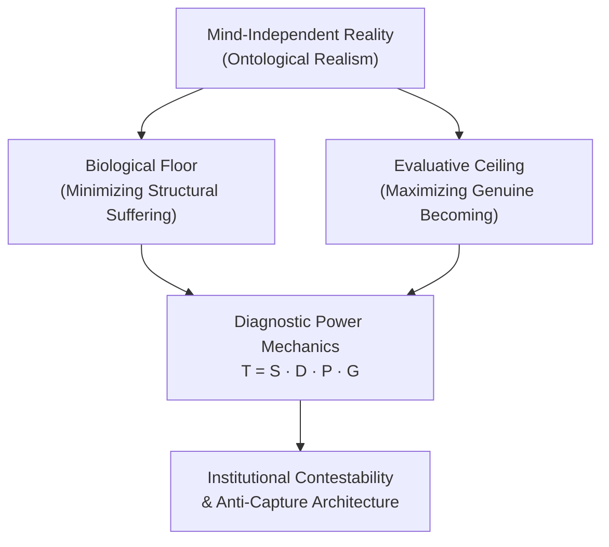

# Progressive Materialist Naturalism (PMN) — Reader Platform & AI Grounding Ecosystem

[](https://github.com/novadharma-hub/pmn-framework/releases)
[](https://novadharma-hub.github.io/pmn-framework/)
[](#quick-start)
[](#official-ai-grounding--machine-endpoints)
[](#overview)
[](https://creativecommons.org/licenses/by-nc/4.0/)
[](./LICENSE)

---

### [📖 Read Online (Web App)](https://novadharma-hub.github.io/pmn-framework/) &nbsp;·&nbsp; [🤖 AI Guide & Grounding](https://novadharma-hub.github.io/pmn-framework/#/guide) &nbsp;·&nbsp; [📥 Download Release (PDF & MD)](https://github.com/novadharma-hub/pmn-framework/releases/tag/v118.6)

A high-performance, offline-capable interactive reader platform and AI grounding ecosystem for the **Progressive Materialist Naturalism (PMN)** philosophical manuscript. 

PMN is a rigorous, post-theistic, materialist philosophical framework engineered to analyze institutional power, dismantle structural capture, minimize biological suffering, and maximize genuine human becoming across multi-generational horizons.

---

## Quick Navigation

- [Overview & Core Philosophy](#overview)
- [Official AI Grounding & Machine Endpoints](#official-ai-grounding--machine-endpoints)
- [Frontier & Local AI Ingestion Guide](#frontier--local-ai-ingestion-guide)
- [Reader Platform Architecture](#reader-platform-architecture)
- [Platform Features](#platform-features)
- [Quick Start & Local Development](#quick-start)
- [Keyboard Shortcuts](#keyboard-shortcuts)
- [CSS Design System & Theme Tokens](#css-token-system)
- [Build, Audit & Release Pipeline](#build--deploy-pipeline)
- [Formatting Rules for Contributors](#formatting-rules-for-contributors)
- [Citation & Academic Reference](#citation)
- [License](#license)

---

## Overview

Progressive Materialist Naturalism (PMN) proceeds from a fundamental thesis: *moral, social, and political philosophy cannot be separated from the material conditions of physical reality and biological embodiment.*



### Core Philosophical Pillars

1. **Epistemic Authority & Ontological Realism (§1.6):** Reality is mind-independent. Analytical rigor requires prioritizing material constraints, thermodynamic limits, and empirical feedback over narrative comforting or scholastic theology.
2. **The Biological Floor (§3.4):** Sentient vulnerability is not subjective preference. The minimization of non-consensual biological and structural suffering serves as the non-negotiable moral foundation.
3. **The Evaluative Ceiling:** Human flourishing and developmental expansion (*becoming*) represent the aspirational vector, conditioned upon the security of the biological floor.
4. **Structural Power Mechanics & Institutional Capture (§7.3c-i):** Power asymmetries systematically convert protective institutions into self-preserving extraction apparatuses through a predictable 5-stage capture sequence.
5. **Universal Contestability & Accountability (§11.x):** No doctrine, office, custodian, or ideology holds immunity from empirical auditing, dissent, and non-violent procedural revision.

---

## Official AI Grounding & Machine Endpoints

PMN provides production-grade, machine-readable discovery indices and grounding corpora for Large Language Models (LLMs), retrieval systems, autonomous coding agents, and academic researchers:

| Endpoint | Format | Description & Primary Use Case | Direct Access URL |
|---|---|---|---|
| **`/llms.txt`** | Plain Text / Markdown | Official standard index ([llmstxt.org](https://llmstxt.org/)) providing summary, architecture map, and file registry. | [`/llms.txt`](https://novadharma-hub.github.io/pmn-framework/llms.txt) |
| **`/llms.json`** | JSON (REST API) | Structured catalog containing full metadata, section manifests, citation counts, and direct deep-links. | [`/llms.json`](https://novadharma-hub.github.io/pmn-framework/llms.json) |
| **`/llms.md`** | Markdown Table | Detailed architectural reference including all 21 parts, analytical modules, and axiomatic relationships. | [`/llms.md`](https://novadharma-hub.github.io/pmn-framework/llms.md) |
| **`/pmn_corpus_for_ai.md`** | Plain Markdown | Full ~330,000-word flat manuscript export stripped of HTML markup. Optimized for 1M+ context windows. | [`/pmn_corpus_for_ai.md`](https://novadharma-hub.github.io/pmn-framework/pmn_corpus_for_ai.md) |

### Programmatic Ingestion Examples

#### cURL / Wget:
```bash
# Fetch LLM discovery index
curl -sL https://novadharma-hub.github.io/pmn-framework/llms.txt

# Fetch structured JSON module manifest
curl -sL https://novadharma-hub.github.io/pmn-framework/llms.json | jq '.modules[0]'

# Download full flat corpus for local RAG / indexing (~2.2MB)
curl -sL https://novadharma-hub.github.io/pmn-framework/pmn_corpus_for_ai.md -o pmn_corpus_v118.6.md
```

#### Python Ingestion:
```python
import urllib.request
import json

# Fetch structured manifest
url = "https://novadharma-hub.github.io/pmn-framework/llms.json"
with urllib.request.urlopen(url) as response:
    manifest = json.loads(response.read().decode('utf-8'))
    print(f"Loaded PMN Version: {manifest['version']}")
    print(f"Total Sections: {manifest['corpus_stats']['total_sections']}")
```

---

## Frontier & Local AI Ingestion Guide

For complete prompts, role profiles, and diagnostic instructions, visit the in-app **[AI Guide (`#/guide`)](https://novadharma-hub.github.io/pmn-framework/#/guide)**.

### 1. Cloud Frontier AI Deployment

- **Claude 3.7 Sonnet (Extended Thinking):** Upload `pmn_corpus_for_ai.md` as Project Knowledge. Ideal for deep institutional forensics, red-teaming arguments, and philosophical tension audits.
- **Google NotebookLM:** Import `https://novadharma-hub.github.io/pmn-framework/llms.txt` and `pmn_corpus_for_ai.md`. Generates grounded study guides, audio overviews, and source-cited Q&A.
- **Gemini 2.5 Flash / Pro (2M Token Window):** Ingest the full flat corpus in a single prompt for systemic cross-part synthesis across all 21 parts simultaneously.
- **OpenAI o1 / o3-mini / GPT-4.5:** Leverage for rigorous mathematical and logical derivations of the transfer formula $T = S \cdot D \cdot P \cdot G$ and economic contestability models.

### 2. Local AI & Private Deployment (Ollama / LM Studio)

Run a sovereign, air-gapped PMN analyst locally using [Ollama](https://ollama.ai):

#### Step 1: Download Corpus
```bash
curl -sL https://novadharma-hub.github.io/pmn-framework/pmn_corpus_for_ai.md -o pmn_corpus.md
```

#### Step 2: Create `Modelfile`
```dockerfile
FROM qwen2.5:32b-instruct
# Alternative: FROM deepseek-r1:14b or llama3.3:70b

PARAMETER temperature 0.3
PARAMETER top_p 0.9

SYSTEM """
You are an expert analyst in Progressive Materialist Naturalism (PMN v118.6).
Ground your analysis in material reality, the biological floor (§3.4), and institutional capture diagnostics (§7.3c-i).
Always cite specific PMN section numbers (e.g., §1.6, §7.3, §15.15) and resist ideological capture or narrative inflation.
"""
```

#### Step 3: Build & Launch
```bash
ollama create pmn-analyst -f Modelfile
ollama run pmn-analyst "Explain how custodian advantage leads to institutional capture according to PMN §7.3."
```

---

## Reader Platform Architecture

The reader platform is built as a zero-dependency-runtime Single-Page Application (SPA) powered by Vite, React 19, and TypeScript:

```
public/
├── index.html                      # Entry HTML shell with meta & PWA headers
├── vite.config.js                  # Vite configuration & ServiceWorker PWA routing
├── package.json                    # Dependencies & build scripts
├── style.css                       # Master typographic and color token engine
│
├── public_static/                  # Static assets served at domain root
│   ├── llms.txt                    # Standard LLM discovery index
│   ├── llms.json                   # Machine-readable JSON manifest
│   ├── llms.md                     # Markdown architectural spec
│   ├── pmn_corpus_for_ai.md        # Full plain-text corpus export (~2.2MB)
│   ├── data/                       # Deployed manuscript chunks & metadata
│   └── favicon.svg                 # Platform icon
│
├── src/
│   ├── main.tsx                    # React mounting & CSS cascade initialization
│   ├── App.tsx                     # Global router, layout, navigation & HomeView
│   ├── index.css                   # Core Tailwind v4 reset & typography rules
│   │
│   └── components/
│       ├── ReaderView.tsx          # Main reading interface (split prose + inspector)
│       ├── GuideView.tsx           # Comprehensive AI Agent & Ingestion Guide (#/guide)
│       ├── ContentsView.tsx        # Table of Contents, Search & Dynamic Index
│       ├── Sidebar.tsx             # Section hierarchy & progress sidebar
│       ├── AITerminal.tsx          # In-page grounding terminal with live context
│       ├── CommandPalette.tsx      # Quick jump & spotlight command modal [Alt+/]
│       ├── KeyboardModal.tsx       # Interactive keyboard shortcut helper [Alt+K]
│       ├── NotesModal.tsx          # Local private margin notes [Alt+N]
│       ├── ParticlesBackground.tsx # Ambient physics canvas background
│       └── VersionManager.tsx      # Manuscript version audit utility
│
├── data/                           # Canonical manuscript JSON data
│   ├── parts.json                  # Complete bundled manuscript
│   ├── parts/                      # Chunked part JSONs for fast lazy-loading
│   ├── gl.json                     # Glossary dictionary (180+ terms)
│   ├── glg.json                    # Categorical glossary grouping
│   ├── look.json                   # Instant section lookup index (ID -> Part/Sub)
│   ├── ci.json                     # Cross-reference bidirectional citation map
│   ├── rel.json                    # Relational conceptual graph
│   └── version.json                # Active build version metadata
│
└── dist/                           # Deployed production build (committed to main)
```

---

## Platform Features

- **Cozy Bookstore & Academic Aesthetics:** Custom serif typography designed for high-density reading without eye fatigue.
- **Instant Section Jumping:** Deep linking to all 235 sections via hash routing (e.g., `#/reader?s=7.3c-i`).
- **Bidirectional Cross-References:** Instant popover inspection and jump navigation across interconnected analytical modules.
- **Multi-Track Reading Paths:** Tailored entry pathways for Foundations, Power & Institutions, Compressed Core (§15.15), and Economic Analysis.
- **Interactive Theoretical Anatomy:** Structural inspector connecting philosophical premises to empirical mechanisms.
- **Zero-Tracking Local Desk:** Private annotations, highlights, and reading positions stored strictly inside browser `localStorage`.
- **Full Offline PWA Support:** Service Worker caching enables complete offline access to all text, tools, and glossary entries.

---

## Quick Start

### Prerequisites
- Node.js 18+ or 20+
- npm 9+

### Development
```bash
# Clone the repository
git clone https://github.com/novadharma-hub/pmn-framework.git
cd pmn-framework

# Install dependencies
npm install

# Start local Vite development server
npm run dev
# -> http://localhost:5173/pmn-framework/
```

### Production Build
```bash
# Compile TypeScript, bundle assets, and generate dist/
npm run build

# Preview production build locally
npm run preview
```

---

## Keyboard Shortcuts

The platform is designed keyboard-first. All shortcuts use `Alt` to prevent OS or browser collisions:

| Key Binding | Action |
|---|---|
| <kbd>Alt</kbd> + <kbd>C</kbd> | Open Table of Contents & Navigation Map |
| <kbd>Alt</kbd> + <kbd>R</kbd> | Resume reading at last active section |
| <kbd>Alt</kbd> + <kbd>/</kbd> | Open Global Search & Command Palette |
| <kbd>Alt</kbd> + <kbd>?</kbd> | Open Glossary & Conceptual Index |
| <kbd>Alt</kbd> + <kbd>N</kbd> | Open Personal Notes & Annotations |
| <kbd>Alt</kbd> + <kbd>F</kbd> | Toggle Distraction-Free Focus Mode |
| <kbd>Alt</kbd> + <kbd>K</kbd> | Show Keyboard Shortcuts Modal |
| <kbd>←</kbd> / <kbd>→</kbd> | Previous / Next analytical section |

---

## CSS Token System

The design system enforces strict semantic CSS tokens declared in `style.css`. **Do not use Tailwind color classes for theme-sensitive UI.** Always leverage CSS variables:

| Token Variable | Light Theme | Dark Theme | Purpose |
|---|---|---|---|
| `var(--bg)` | `#fdfbf7` (Warm cream) | `#0d0d0d` (Deep obsidian) | Page canvas background |
| `var(--bg2)` | `#f7f3eb` (Paper light) | `#171717` (Surface panel) | Card & sidebar containers |
| `var(--ink)` | `#1c1510` (Deep charcoal) | `#f5f0e8` (Soft parchment) | Primary prose text |
| `var(--ink2)` | `#4a3a2d` (Muted umber) | `#c8bfb2` (Secondary stone) | Subheadings & metadata |
| `var(--acc)` | `#b83a1b` (Terracotta crimson) | `#c0271a` (Vibrant carmine) | Primary brand accent |
| `var(--mute)` | `#756456` (Dust umber) | `#8a7d6e` (Subtle grey) | Borders, captions, hints |
| `var(--rule)` | `#e8dcc4` (Parchment line) | `#302b27` (Charcoal line) | Section dividing rules |

---

## Build, Audit & Release Pipeline

The root PMN repository enforces a single automated pipeline:

1. **DOCX Ingestion:** Python pipeline (`public/scripts/pmn_tools/`) parses the canonical manuscript (`private/docx_source/PMN_Framework_v118.6.docx`).
2. **Structural Integrity Audit:** Run `pmn_check.py` to verify section anchors, bibliography citations, and cross-references:
   ```bash
   python public/scripts/pmn_tools/pmn_check.py v118.6
   ```
3. **Frontend Compilation:** Vite builds production assets into `public/dist/`.
4. **Endpoint Synchronization:** Copies `llms.txt`, `llms.json`, `llms.md`, and `pmn_corpus_for_ai.md` to `public_static/` and `dist/`.
5. **PWA Offline Routing:** Verifies Service Worker fallback exclusion patterns for raw text/json files.

---

## Formatting Rules for Contributors

When contributing code or automated tooling to this repository:
1. **Never hand-edit generated manuscript files:** `data/parts.json`, `data/parts/`, `pmn_corpus_for_ai.md`, or `dist/` must be generated through the official build pipeline.
2. **HTML Quote Escaping:** Manuscript HTML strings inside JSON files must escape internal quotes as `\"`.
3. **Cross-References:** Use the canonical format `<a class=\"xref\" href=\"#3.2\" data-sid=\"3.2\">3.2</a>`.
4. **Theme Adherence:** Always use `var(--token)` from `style.css`. Never introduce hardcoded hex colors into component styles.
5. **Verification Gate:** Verify clean build (`npm run build`) with zero lint/TypeScript errors before submitting pull requests.

---

## Citation

If you reference, analyze, or cite Progressive Materialist Naturalism in academic publications, books, or AI grounding studies, please use the following citation formats:

### APA (7th ed.)
```text
Dharma, N. (2026). Progressive Materialist Naturalism: A Framework for Minimizing Structural Suffering and Maximizing Genuine Becoming (Version 118.6) [Manuscript]. Novadharma Hub. https://novadharma-hub.github.io/pmn-framework/
```

### BibTeX
```bibtex
@book{dharma2026pmn,
  author    = {Nova Dharma and PMN Working Group},
  title     = {Progressive Materialist Naturalism: A Framework for Minimizing Structural Suffering and Maximizing Genuine Becoming},
  year      = {2026},
  version   = {v118.6},
  url       = {https://novadharma-hub.github.io/pmn-framework/},
  publisher = {Novadharma Hub}
}
```

---

## License

- **Platform Code:** The reader application software, UI components, and build tools are released under the **[MIT License](./LICENSE)**.
- **Manuscript Content:** The PMN manuscript, theoretical corpus, glossary definitions, and AI grounding texts are licensed under **[Creative Commons Attribution-NonCommercial 4.0 International (CC BY-NC 4.0)](https://creativecommons.org/licenses/by-nc/4.0/)**.

---

<p align="center">
  <em>"Philosophers have only interpreted the world in various ways. The point, however, is to reconstruct its material foundations."</em><br>
  — <strong>Nova Dharma</strong>
</p>

