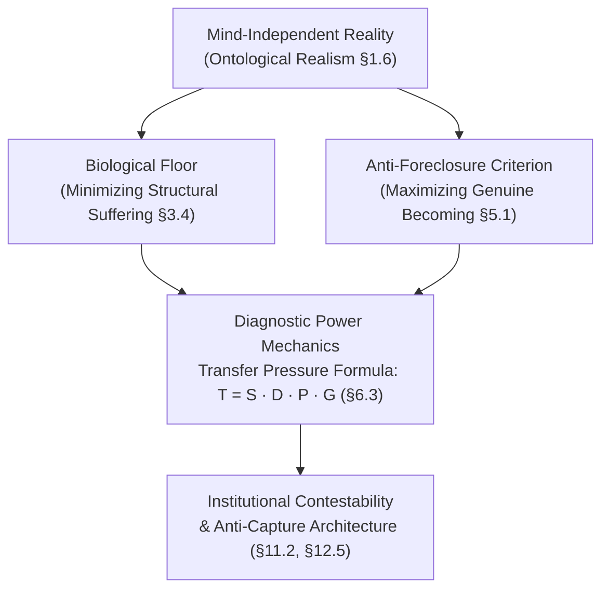

# Progressive Materialist Naturalism (PMN) — Reader Platform & AI Grounding Ecosystem

[](https://github.com/novadharma-hub/pmn-framework/releases)
[](https://novadharma-hub.github.io/pmn-framework/)
[](#quick-start)
[](#official-ai-grounding--machine-endpoints)
[](#overview)
[](https://creativecommons.org/licenses/by-sa/4.0/)
[](./LICENSE)

---

### [📖 Read Online (Web App)](https://novadharma-hub.github.io/pmn-framework/) &nbsp;·&nbsp; [🤖 AI Guide & Grounding](https://novadharma-hub.github.io/pmn-framework/#/guide) &nbsp;·&nbsp; [📥 Download Release (PDF & MD)](https://github.com/novadharma-hub/pmn-framework/releases/tag/v118.6)

A high-performance, offline-capable interactive reader platform and AI grounding ecosystem for the **Progressive Materialist Naturalism (PMN)** philosophical manuscript (v118.6 Canonical by **Nova Dharma**).

PMN is a post-theistic, materialist philosophical framework engineered to analyze institutional power, dismantle structural capture, minimize non-consensual biological suffering, and maximize genuine human becoming across multi-generational horizons.

---

## Quick Navigation

- [Overview & Core Philosophy](#overview)
- [Flagship Interactive Reader Engines](#flagship-interactive-reader-engines)
  - [1. Reading Paths Engine (6 Curated Pathways)](#1-reading-paths-engine)
  - [2. Theoretical Anatomy Inspector (4 Diagnostic Modes)](#2-theoretical-anatomy-inspector)
  - [3. Axiomatic Architecture (11 Axioms in 3 Tiers)](#3-axiomatic-architecture)
  - [4. In-Reader AI Grounding Terminal](#4-in-reader-ai-grounding-terminal)
- [Zero-Tracking Private Reading Desk & Offline PWA](#zero-tracking-private-reading-desk--offline-pwa)
- [Official AI Grounding & Machine Endpoints](#official-ai-grounding--machine-endpoints)
- [Frontier & Developer API Ingestion Guide](#frontier--developer-api-ingestion-guide)
  - [1. Cloud Frontier AI Deployment (2026 Lineup)](#1-cloud-frontier-ai-deployment-2026-lineup)
  - [2. Developer API Harness (Python SDK / Automated Auditing)](#2-developer-api-harness)
  - [3. Sovereign Local Inference (Ollama / vLLM / SGLang)](#3-sovereign-local-inference)
  - [4. Multi-Tier Model Selection Matrix](#4-multi-tier-model-selection-matrix)
- [Repository Architecture & Complete Directory Map](#repository-architecture--complete-directory-map)
- [Quick Start & Local Development](#quick-start)
- [Keyboard Shortcuts](#keyboard-shortcuts)
- [CSS Design System & Theme Tokens](#css-token-system)
- [Build, Audit & Release Pipeline](#build-audit--release-pipeline)
- [Formatting Rules for Contributors](#formatting-rules-for-contributors)
- [Citation & Academic Reference](#citation)
- [License](#license)

---

## Overview

Progressive Materialist Naturalism (PMN) proceeds from a fundamental thesis: *moral, social, and political philosophy cannot be separated from the material conditions of physical reality and biological embodiment.*



### Core Philosophical Pillars

1. **Epistemic Authority & Ontological Realism (§1.1, §1.6):** Reality is mind-independent. Analytical rigor requires prioritizing material constraints, thermodynamic limits, and empirical feedback over narrative comforting, scholastic theology, or discursive idealism.
2. **The Biological Floor (§3.0–§3.4):** Sentient vulnerability is not subjective preference. The minimization of non-consensual biological and structural suffering serves as the non-negotiable moral bedrock.
3. **The Anti-Foreclosure Criterion (§5.1):** Human flourishing and developmental expansion (*genuine becoming*) represent the aspirational evaluative ceiling, conditioned upon the prior security of the biological floor.
4. **Structural Power Mechanics & Institutional Capture (§6.2, §7.3c-i):** Power asymmetries systematically convert protective institutions into self-preserving extraction apparatuses through a predictable 5-stage capture sequence.
5. **Universal Contestability & Accountability (§11.2, §12.5):** No doctrine, office, custodian, or ideology holds immunity from empirical auditing, dissent, and non-violent procedural revision.

---

## Flagship Interactive Reader Engines

The PMN web platform features four specialized interactive modules designed to transform complex philosophical prose into diagnostic, navigable instruments:

### 1. Reading Paths Engine

Rather than forcing linear reading across all 330,000 words, the **Reading Paths Engine** offers six curated navigational pathways tailored to distinct reader personas and research objectives:

| Path | Track Title | Target Persona | Est. Time & Scope | Key Sequence |
|---|---|---|---|---|
| **01** | **Epistemic Foundations & Realism** | Academic Philosophers & Epistemologists | ~40 min · 4 Modules | §1.1 &rarr; §1.6 &rarr; §2.4 &rarr; §3.4 |
| **02** | **Power Forensics & Anti-Capture** | Policy Analysts & Institutional Auditors | ~50 min · 4 Modules | §6.2 &rarr; §7.1 &rarr; §7.3c-i &rarr; §8.2 |
| **03** | **Compressed Core (Fast-Track)** | Rapid Onboarding & AI Context Briefings | ~25 min · 4 Modules | §15.15 &rarr; §1.6 &rarr; §3.4 &rarr; §7.3 |
| **04** | **Applied Ethics, Agency & Becoming** | Ethicists & Existential Practitioners | ~45 min · 4 Modules | §3.4 &rarr; §5.1 &rarr; §17.1 &rarr; §18.2 |
| **05** | **Situation Diagnostics & Field Audit** | Institutional Reformers & Strategists | ~55 min · 4 Modules | §2.4 &rarr; §6.3 &rarr; §7.3 &rarr; §11.2 |
| **06** | **Economic Doctrine & Contestability** | Political Economists & Policy Designers | ~45 min · 4 Modules | §11.1 &rarr; §11.3 &rarr; §11.5 &rarr; §12.1 |

*Each path tracks reading progress locally, provides deep-link jump affordances, and provides direct copyable paths for study groups.*

### 2. Theoretical Anatomy Inspector

An interactive diagnostic visualizer dissecting the manuscript's architectural mechanics across four specialized modes:

1. **Non-Reductive Layered Architecture (`layers`):** Explores the three non-collapsible analytical strata:
   - **Layer 1: Material Ground & Biological Constraints (Parts I–IV):** Thermodynamic limits, biospheric carrying capacity, and somatic vulnerability (§3.4).
   - **Layer 2: Institutional Force Fields & Structural Power (Parts VI–XII):** Custodian incentives, information hoarding, and systemic extraction (§7.3).
   - **Layer 3: Genuine Becoming & Subjective Agency (Parts V, XVII–XXI):** Navigational agency, ethical praxis, and developmental expansion (§5.1).
2. **Transfer Pressure Formula (`formula`):** Deconstructs the multiplicative surplus transfer equation:
   $$\mathbf{T = S \cdot D \cdot P \cdot G}$$
   - $\mathbf{S}$ (*Structural Surplus*): Total extractable material or cognitive surplus (§6.3a).
   - $\mathbf{D}$ (*Dependency Asymmetry*): Constituent reliance on institutional provision (§6.3b).
   - $\mathbf{P}$ (*Exit Penalty*): Material, social, or legal cost of defection (§6.3c).
   - $\mathbf{G}$ (*Governance Opacity*): Informational and procedural hoarding by custodians (§6.3d).
   *(Demonstrates mathematically why minimizing opacity $G$ or exit penalty $P$ to near zero collapses predatory leverage).*
3. **5-Stage Institutional Capture Lifecycle (`capture`):** Diagnostic audit tool tracing institutional decay:
   - *Stage 1: Mandate Inception* &rarr; *Stage 2: Custodian Specialization* &rarr; *Stage 3: Information Asymmetry* &rarr; *Stage 4: Extractive Entrenchment* &rarr; *Stage 5: Ideological Naturalization*.
4. **Part Structure Navigator (`parts`):** Structural explorer mapping all 21 Roman-numeral parts from foundational ontology to applied civilizational praxis.

### 3. Axiomatic Architecture

A formal epistemological registry codifying PMN into **11 canonical axioms** distributed across three epistemological tiers. In accordance with PMN's anti-dogmatic criterion (§1.4), each axiom is defined alongside its **formal defense** and **explicit falsification conditions**:

- **Tier 1 — Foundational Axioms:**
  - `1a`: *Mind-Independent Material Reality is Primary* (§1.6)
  - `1b`: *Biological Suffering Has Negative Evaluative Valence* (§3.4)
  - `1c`: *Genuine Becoming is Evaluatively Significant* (§5.1)
  - `1d`: *Anti-Dogmatic Design & Zero Authority Privilege* (§1.4)
- **Tier 2 — Structural Commitments:**
  - `2a`: *Conditional Biological Constraints* (§3.2)
  - `2b`: *Non-Collapsible Layered Architecture* (§2.4)
  - `2c`: *Universal Institutional Contestability* (§11.2)
  - `2d`: *Bounds of Coercive Proportionality* (§7.4)
- **Tier 3 — Empirical Hypotheses:**
  - `3a`: *Information Asymmetry as Structural Power* (§7.3)
  - `3b`: *Narrative Inertia & Discourse Retardation* (§8.2)
  - `3c`: *Multiplicative Transfer Equation ($T = S \cdot D \cdot P \cdot G$)* (§6.3)

### 4. In-Reader AI Grounding Terminal

An integrated workbench accessible directly inside the reader modal (`AITerminal.tsx`):
- **Dynamic Context Injection:** Automatically bundles active reading sections and bibliography anchors into clean LLM context blocks.
- **Token Budget Transparency:** Real-time token estimations and word counts before copying prompts.
- **Persona & Task Modes:** One-click pre-configured prompts for *Socratic Red-Teaming*, *Institutional Capture Audit*, *Epistemic Verification*, and *Philosophical Translation*.

---

## Zero-Tracking Private Reading Desk & Offline PWA

The PMN reader platform operates under strict **Privacy by Architectural Design**:

- **Zero Telemetry & Zero Analytics:** No Google Analytics, no tracking pixels, no telemetry scripts, and no third-party network requests.
- **Client-Side Local Storage Desk:** Margin notes (<kbd>Alt</kbd> + <kbd>N</kbd>), reading progress markers, bookmarks, and font preferences are stored strictly inside the client's browser `localStorage`. Your thoughts and reading habits never leave your machine.
- **Offline Progressive Web App (PWA):** Equipped with a robust Service Worker (`vite-plugin-pwa` + `Workbox`) caching all 21 parts, glossary entries, search indexes, and styling tokens. Once loaded, the reader functions completely air-gapped without an internet connection.

---

## Official AI Grounding & Machine Endpoints

PMN provides production-grade, machine-readable discovery indices and grounding corpora for Large Language Models (LLMs), retrieval systems, autonomous coding agents, and academic researchers:

| Endpoint | Format | Description & Primary Use Case | Direct Access URL |
|---|---|---|---|
| **`/llms.txt`** | Plain Text / Markdown | Official standard index ([llmstxt.org](https://llmstxt.org/)) providing summary, architecture map, and file registry. | [`/llms.txt`](https://novadharma-hub.github.io/pmn-framework/llms.txt) |
| **`/llms.json`** | JSON (REST API) | Structured catalog containing full metadata, section manifests, citation counts, and direct deep-links. | [`/llms.json`](https://novadharma-hub.github.io/pmn-framework/llms.json) |
| **`/llms.md`** | Markdown Table | Detailed architectural reference including all 21 parts, analytical modules, and axiomatic relationships. | [`/llms.md`](https://novadharma-hub.github.io/pmn-framework/llms.md) |
| **`/pmn_corpus_for_ai.md`** | Plain Markdown | Full ~330,000-word flat manuscript export stripped of HTML markup. Optimized for 1M+ context windows. | [`/pmn_corpus_for_ai.md`](https://novadharma-hub.github.io/pmn-framework/pmn_corpus_for_ai.md) |
| **`data/parts/part_*.json`** | JSON REST Endpoints | Individual modular endpoints for each of the 21 parts for lightweight per-module programmatic querying. | [`data/parts/manifest.json`](https://novadharma-hub.github.io/pmn-framework/data/parts/manifest.json) |

### Programmatic Ingestion Examples

#### cURL / Wget:
```bash
# 1. Fetch LLM discovery index
curl -sL https://novadharma-hub.github.io/pmn-framework/llms.txt

# 2. Fetch structured JSON module manifest
curl -sL https://novadharma-hub.github.io/pmn-framework/llms.json | jq '.modules[0]'

# 3. Download full flat corpus for local RAG / indexing (~2.3MB)
curl -sL https://novadharma-hub.github.io/pmn-framework/pmn_corpus_for_ai.md -o pmn_corpus_v118.6.md
```

#### Python Ingestion (REST & Modular Query):
```python
import urllib.request
import json

# Fetch structured manifest
url = "https://novadharma-hub.github.io/pmn-framework/llms.json"
with urllib.request.urlopen(url) as response:
    manifest = json.loads(response.read().decode('utf-8'))
    print(f"Loaded PMN Version: {manifest['version']}")
    print(f"Total Sections: {manifest['corpus_stats']['total_sections']}")

# Fetch Part VI (Power Dynamics & Institutional Capture) modularly
part_vi_url = "https://novadharma-hub.github.io/pmn-framework/data/parts/part_VI.json"
with urllib.request.urlopen(part_vi_url) as response:
    part_vi = json.loads(response.read().decode('utf-8'))
    print(f"Part VI Title: {part_vi['title']}")
```

---

## Frontier & Developer API Ingestion Guide

For complete prompts, role profiles, and diagnostic instructions, visit the in-app **[AI Guide (`#/guide`)](https://novadharma-hub.github.io/pmn-framework/#/guide)**.

### 1. Cloud Frontier AI Deployment (2026 Lineup)

- **Anthropic Claude (Opus 5 / Sonnet 5 / Fable 5.1):** 1M-token context with Adaptive Thinking. Upload `pmn_corpus_for_ai.md` into Project Knowledge. Ideal for sustained philosophical dialectics, assumption archaeology (§12.1), and institutional red-teaming.
- **Google DeepMind (Gemini 3.1 Pro / Gemini 3.8 Flash / NotebookLM):** 1M–2M token context windows. Ingests the full ~330k-word uncompressed corpus in a single prompt. NotebookLM provides grounded source citations linked directly back to section anchors.
- **DeepSeek (DeepSeek-V4-Pro / DeepSeek-V4-Flash / DeepSeek-R1):** 1.6T MoE (49B active) with Hybrid Attention & Multi-Head Latent Attention, alongside pure RL reasoning models. Industry-leading capture sequence diagnostics (§7.3c-i) and anti-ideology forensics.
- **OpenAI (GPT-6 Astra / o3 / o3-pro / GPT-5.6 Sol):** 1M context with advanced multi-step reasoning. Formalizes and simulates the non-linear Transformation Pressure Formula ($T = S \cdot D \cdot P \cdot G$) via Code Interpreter.
- **Alibaba Qwen & Zhipu GLM (Qwen 3.8-Max / GLM-5.3 / GLM-5.2):** High-capacity agentic architectures for multi-tool workflows, automated data pipelining, and institutional compliance audits.

### 2. Developer API Harness

For automated auditing, continuous integration testing, and research scripts, query frontier models via direct API calls injecting canonical PMN context:

```python
import os
import requests

CORPUS_URL = "https://novadharma-hub.github.io/pmn-framework/pmn_corpus_for_ai.md"

def fetch_pmn_corpus():
    r = requests.get(CORPUS_URL)
    r.raise_for_status()
    return r.text

def audit_institution_with_pmn(policy_document: str, api_key: str):
    corpus_text = fetch_pmn_corpus()
    system_prompt = (
        "You are an expert institutional auditor grounded in Progressive Materialist Naturalism (PMN v118.6).\n"
        "Analyze the provided institutional policy against the PMN 5-stage capture cycle (§7.3c-i) "
        "and calculate potential transfer pressure using T = S · D · P · G (§6.3).\n"
        "Strictly cite PMN section anchors."
    )
    # Execute API call to Anthropic, OpenAI, or Gemini endpoint
    # ...
```

### 3. Sovereign Local Inference (Ollama / vLLM / SGLang)

Run a sovereign, air-gapped PMN analyst locally with zero cloud telemetry using [Ollama](https://ollama.ai) or high-throughput [vLLM](https://github.com/vllm-project/vllm):

#### Step 1: Download Corpus
```bash
curl -sL https://novadharma-hub.github.io/pmn-framework/pmn_corpus_for_ai.md -o pmn_corpus_v118.6.md
```

#### Step 2: Create `Modelfile` (Ollama 64K Context)
```dockerfile
FROM qwen2.5:32b
# Alternatives: FROM qwq:32b, deepseek-r1:32b, or llama3.3:70b

PARAMETER temperature 0.25
PARAMETER top_p 0.85
PARAMETER num_ctx 65536

SYSTEM """
You are an expert analyst in Progressive Materialist Naturalism (PMN v118.6 by Nova Dharma).
Ground your analysis in material reality, the biological floor (§3.4), and institutional capture diagnostics (§7.3c-i).
Always cite specific PMN section numbers (e.g., §1.3, §3.4c, §6.5, §7.3c-i, §15.15) and resist ideological capture or narrative inflation.
"""
```

#### Step 3: Build & Launch
```bash
ollama create pmn-analyst -f Modelfile
ollama run pmn-analyst "Explain how custodian advantage leads to institutional capture according to PMN §7.3."
```

### 4. Multi-Tier Model Selection Matrix

| Task Category | Recommended Frontier Tier | Recommended Fast / Economy Tier | Recommended Local / Sovereign Tier |
|---|---|---|---|
| **Deep Dialectic Red-Teaming** | Claude Opus 5 / Gemini 3.1 Pro | Claude Sonnet 5 / DeepSeek V4-Pro | Qwen 2.5 72B / DeepSeek-R1 70B |
| **Institutional Capture Audits** | DeepSeek R1 / OpenAI o3 | Gemini 3.8 Flash / GPT-5.6 Sol | QwQ 32B / DeepSeek-R1 32B |
| **Whole-Corpus RAG & Retrieval** | Gemini 3.1 Pro (2M) / Claude Sonnet 5 | Gemini 3.8 Flash (1M) | vLLM + Qwen2.5-32B (64k-128k) |
| **Formula & Econometric Modeling** | OpenAI o3-pro / GPT-6 Astra | Claude 3.7 Sonnet / DeepSeek V4 | Qwen2.5-Coder-32B |

---

## Repository Architecture & Complete Directory Map

Every file and directory in this repository is strictly curated and serves a specific production role:

```
pmn-framework/
├── .github/
│   └── workflows/deploy.yml        # Automated GitHub Pages CI/CD deployment pipeline
├── data/                           # Canonical manuscript JSON data (Modular & Bundled)
│   ├── parts.json                  # Complete bundled manuscript (all 21 parts)
│   ├── parts/                      # Modular per-part JSON files for lazy loading & REST APIs
│   │   ├── manifest.json           # Registry of all 21 parts, titles, and section spans
│   │   └── part_*.json             # Individual JSON payload for each part
│   ├── gl.json                     # Complete glossary dictionary (237 philosophical terms)
│   ├── glg.json                    # Categorical groupings of glossary terms
│   ├── look.json                   # Fast O(1) section ID lookup index (e.g., "7.3c-i" -> part/sub)
│   ├── ci.json                     # Cross-reference bidirectional citation graph
│   ├── quotes.json                 # Curated canonical thesis quotes
│   ├── rel.json                    # Relational conceptual graph across analytical domains
│   └── version.json                # Canonical release version metadata (v118.6)
│
├── public_static/                  # Static assets mirrored to the domain root
│   ├── llms.txt                    # Standard LLM discovery index (llmstxt.org)
│   ├── llms.json                   # Machine-readable JSON REST API catalog
│   ├── llms.md                     # Architectural markdown specification
│   ├── pmn_corpus_for_ai.md        # Full uncompressed flat manuscript text (~2.3MB)
│   ├── PMN_Latest.md               # Direct download alias for latest manuscript Markdown
│   ├── PMN_Latest.pdf              # Direct download alias for latest manuscript PDF
│   ├── data/                       # Deployed mirror of data/ directory for web routing
│   └── icons/                      # PWA high-resolution application icons (192px & 512px)
│
├── src/                            # Modern React 18 + TypeScript SPA source code
│   ├── main.tsx                    # Application entry point & theme initialization
│   ├── App.tsx                     # Top-level shell, global navigation & HomeView
│   ├── routing.ts                  # Hash-based deep link router with section anchor parsing
│   ├── index.css                   # Tailwind v4 directives & typographic measure constraints
│   ├── lib/                        # Optional decoupled client-side sync connectors
│   └── components/                 # Production UI components
│       ├── ReaderView.tsx          # Dual-column reading interface (prose + dynamic inspector)
│       ├── GuideView.tsx           # Comprehensive Frontier & Local AI Ingestion Guide (#/guide)
│       ├── ReadingPathsSection.tsx # Interactive 6-track Reading Paths engine
│       ├── TheoreticalAnatomySection.tsx # 4-mode Theoretical Anatomy diagnostic visualizer
│       ├── AxiomStructureSection.tsx     # 11-Axiom formal epistemological matrix
│       ├── AITerminal.tsx          # In-page grounding terminal with live section injection
│       ├── ContentsView.tsx        # Comprehensive Table of Contents & Dynamic Index
│       ├── Sidebar.tsx             # Collapsible section hierarchy & progress navigation
│       ├── CommandPalette.tsx      # Spotlight search & instant section switcher [Alt+/]
│       ├── KeyboardModal.tsx       # Interactive keyboard shortcuts modal [Alt+K]
│       ├── NotesModal.tsx          # Local zero-tracking margin annotations desk [Alt+N]
│       ├── ParticlesBackground.tsx # Ambient canvas background
│       └── VersionManager.tsx      # Version verification & changelog viewer
│
├── scripts/                        # Production Python audit, verification, and conversion tools
│   ├── pmn_tools/                  # Core structural auditing utilities
│   │   ├── pmn_check.py            # Structural gatekeeper (xrefs, duplicate IDs, orphan bib)
│   │   ├── pmn_diff.py             # Precise semantic version differ
│   │   └── pmn_ledger.py           # Canonical section sequence and status tracking
│   ├── preflight.py                # Pre-release verification suite
│   ├── docx_import_pipeline.py     # DOCX to structured JSON extraction pipeline
│   ├── security_check.py           # Pre-commit secret and privacy de-identification scanner
│   └── verify_formatting.py        # Markdown and typographical consistency validator
│
├── dist/                           # Compiled production PWA bundle (served via GitHub Pages)
├── index.html                      # HTML5 entry document with complete OpenGraph & PWA metadata
├── style.css                       # Master semantic CSS variable token engine
├── vite.config.js                  # Vite bundler configuration & PWA Service Worker caching rules
├── tsconfig.json                   # TypeScript compiler configuration
├── DESIGN.md                       # Complete UI/UX Specification v2.0
├── LICENSE                         # Dual-license definitions (MIT Platform / CC BY-SA 4.0 Corpus)
└── README.md                       # This canonical repository presentation document
```

---

## Quick Start

### Prerequisites
- Node.js 18+ or 20+
- npm 9+
- Python 3.11+ (for running validation scripts)

### Development
```bash
# Clone the repository
git clone https://github.com/novadharma-hub/pmn-framework.git
cd pmn-framework

# Install dependencies
npm install

# Start local Vite development server
npm run dev
# -> http://localhost:5173/pmn-framework/
```

### Production Build
```bash
# Compile TypeScript, bundle assets, and generate dist/
npm run build

# Preview production build locally
npm run preview
```

---

## Keyboard Shortcuts

The platform is designed keyboard-first. All shortcuts use <kbd>Alt</kbd> to prevent browser or operating system shortcut collisions:

| Key Binding | Action | Description |
|---|---|---|
| <kbd>Alt</kbd> + <kbd>C</kbd> | **Contents** | Open Table of Contents & Navigation Map |
| <kbd>Alt</kbd> + <kbd>R</kbd> | **Resume** | Jump directly to last active reading section |
| <kbd>Alt</kbd> + <kbd>/</kbd> | **Command Palette** | Open Global Search & Spotlight Switcher |
| <kbd>Alt</kbd> + <kbd>?</kbd> | **Glossary** | Open 237-term Conceptual Glossary & Index |
| <kbd>Alt</kbd> + <kbd>N</kbd> | **Notes** | Open Private Margin Notes & Local Desk |
| <kbd>Alt</kbd> + <kbd>F</kbd> | **Focus Mode** | Toggle distraction-free reading canvas |
| <kbd>Alt</kbd> + <kbd>K</kbd> | **Shortcuts** | Display interactive Keyboard Shortcuts Cheat Sheet |
| <kbd>←</kbd> / <kbd>→</kbd> | **Navigation** | Navigate to previous / next analytical section |

---

## CSS Token System

The design system enforces strict semantic CSS tokens declared in `style.css`. **Do not use Tailwind color classes for theme-sensitive UI.** Always leverage CSS variables:

| Token Variable | Light Theme | Dark Theme | Purpose |
|---|---|---|---|
| `var(--bg)` | `#fdfbf7` (Warm cream) | `#0d0d0d` (Deep obsidian) | Page canvas background |
| `var(--bg2)` | `#f7f3eb` (Paper light) | `#171717` (Surface panel) | Card & sidebar containers |
| `var(--ink)` | `#1c1510` (Deep charcoal) | `#f5f0e8` (Soft parchment) | Primary prose text |
| `var(--ink2)` | `#4a3a2d` (Muted umber) | `#c8bfb2` (Secondary stone) | Subheadings & metadata |
| `var(--acc)` | `#b83a1b` (Terracotta crimson) | `#c0271a` (Vibrant carmine) | Primary brand accent |
| `var(--mute)` | `#756456` (Dust umber) | `#8a7d6e` (Subtle grey) | Borders, captions, hints |
| `var(--rule)` | `#e8dcc4` (Parchment line) | `#302b27` (Charcoal line) | Section dividing rules |

---

## Build, Audit & Release Pipeline

The PMN publication workflow enforces a rigorous, automated verification gate:

1. **DOCX Extraction:** Python pipeline (`scripts/docx_import_pipeline.py`) parses the canonical manuscript (`private/docx_source/PMN_Framework_v118.6.docx`).
2. **Structural Integrity Audit:** Run `pmn_check.py` to audit section numbering, broken cross-references, orphan bibliography items, and duplicate anchors:
   ```bash
   python scripts/pmn_tools/pmn_check.py v118.6
   ```
3. **Frontend Compilation:** Vite compiles TypeScript and bundles assets into `dist/`:
   ```bash
   npm run build
   ```
4. **Machine Endpoint Synchronization:** Endpoints (`llms.txt`, `llms.json`, `llms.md`, `pmn_corpus_for_ai.md`) are verified and synced across root, `public_static/`, and `dist/`.
5. **Pre-Release Preflight:** Automated checks ensure clean git working trees, validated checksums, and zero unescaped HTML entities.

---

## Formatting Rules for Contributors

When contributing code or automated tooling to this repository:
1. **Never hand-edit generated manuscript files:** `data/parts.json`, `data/parts/`, `pmn_corpus_for_ai.md`, or `dist/` must be generated through the official build pipeline.
2. **HTML Quote Escaping:** Manuscript HTML strings inside JSON files must escape internal quotes as `"`.
3. **Canonical Cross-References:** Use the canonical format `<a class="xref" href="#3.2" data-sid="3.2">3.2</a>`.
4. **Theme Token Adherence:** Always use `var(--token)` from `style.css`. Never introduce hardcoded hex colors into component styles.
5. **Verification Gate:** Ensure `npm run build` compiles with 0 errors and `pmn_check.py` returns `BERSIH` before opening pull requests.

---

## Citation

If you reference, analyze, or cite Progressive Materialist Naturalism in academic publications, books, policy whitepapers, or AI grounding studies, please use the following citation formats:

### APA (7th ed.)
```text
Dharma, N. (2026). Progressive Materialist Naturalism: A Framework for Minimizing Structural Suffering and Maximizing Genuine Becoming (Version 118.6) [Manuscript]. Novadharma Hub. https://novadharma-hub.github.io/pmn-framework/
```

### BibTeX
```bibtex
@book{dharma2026pmn,
  author    = {Nova Dharma and PMN Working Group},
  title     = {Progressive Materialist Naturalism: A Framework for Minimizing Structural Suffering and Maximizing Genuine Becoming},
  year      = {2026},
  version   = {v118.6},
  url       = {https://novadharma-hub.github.io/pmn-framework/},
  publisher = {Novadharma Hub}
}
```

---

## License

- **Platform Code:** The reader web application, UI components, interactive engines, and build scripts are licensed under the **[MIT License](./LICENSE)**.
- **Manuscript Content:** The PMN manuscript, theoretical corpus, glossary definitions, and AI grounding texts are licensed under **[Creative Commons Attribution-ShareAlike 4.0 International (CC BY-SA 4.0)](https://creativecommons.org/licenses/by-sa/4.0/)**.

---

<p align="center">
  <em>"Philosophers have only interpreted the world in various ways. The point, however, is to reconstruct its material foundations."</em><br>
  — <strong>Nova Dharma</strong>
</p>
